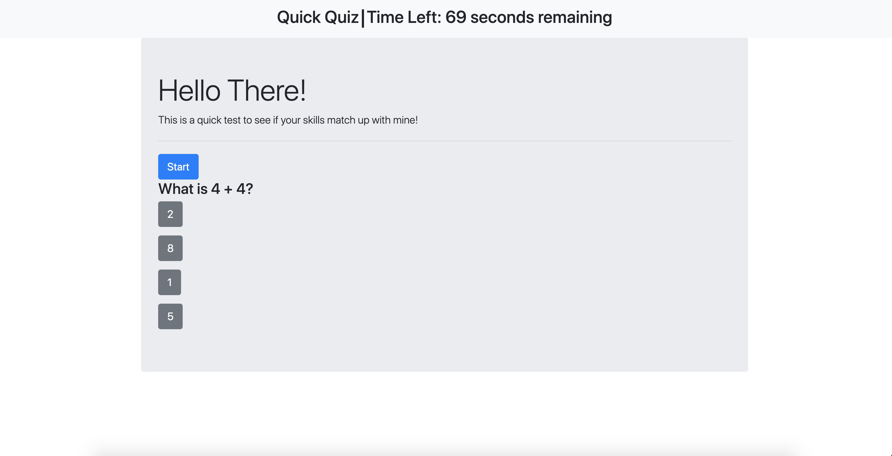

# 04-Web-APIs-Quiz

## Overview

The purpose of this application is to show my skills with what I have learned thought the coding bootcamp at The University of Utah. This specific Project was to make a Quiz that uses an external JavaScript Array.

### Gallery

Start Page:

Quiz Page:

### Problem

Currently ... Working with everything but the bonus content (Add audio files to alert the user of correct or incorrect answers. Be sure to include the appropriate license. Customize the application theme. Create multiple quizzes and an option for users to choose between them. Add the application to your portfolio.)

### Solution

My solution will to implement them later on to make sure I understand their concept

## Tech and Features Used

* Bootstrap
* Javascript
* Library API

## How to use

All you need to know is that you can implement your own quiz based on the questions.js file.

<!-- ## Technical Overview

1. The main component (PullMultiple) contains an array of the user ID's from the users input.
2. That component has a generator function that iterates over the array and adds the ID #'s one by one to an array to be processed.
3. For every ID # in the array to be processed, a "DataGatherer" component is created.
4. This DataGatherer component fires off all of the api calls and renders the progress to the screen.
5. These API calls are called in an asynchronous fashion in order to reduce strain on the server handling the queries.
6. As the API calls are being made, links to the finished .csv files are being saved to state.
7. The download button downloads several links at once from the saved links in state.
8. When all API calls have finished for an ID, the next iterator of the generator function is fired and the next ID goes through it's gathering phase.
9. The reset button cancels all API calls and bring highest component back to empty. -->

Link to example readme:

https://braydon-nelson.github.io/04-Web-APIs-Quiz/
